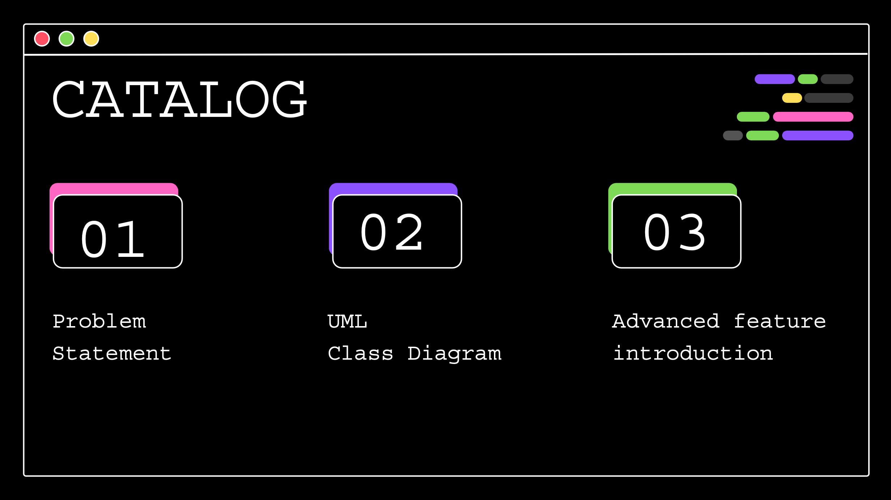
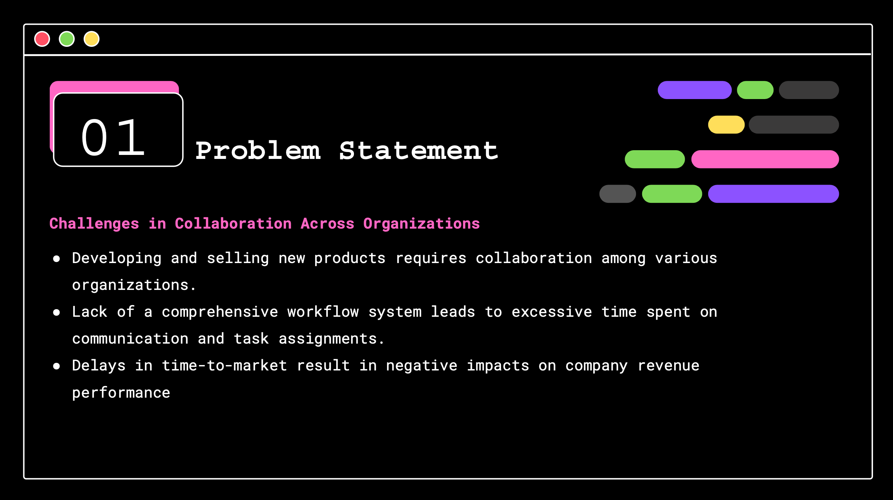
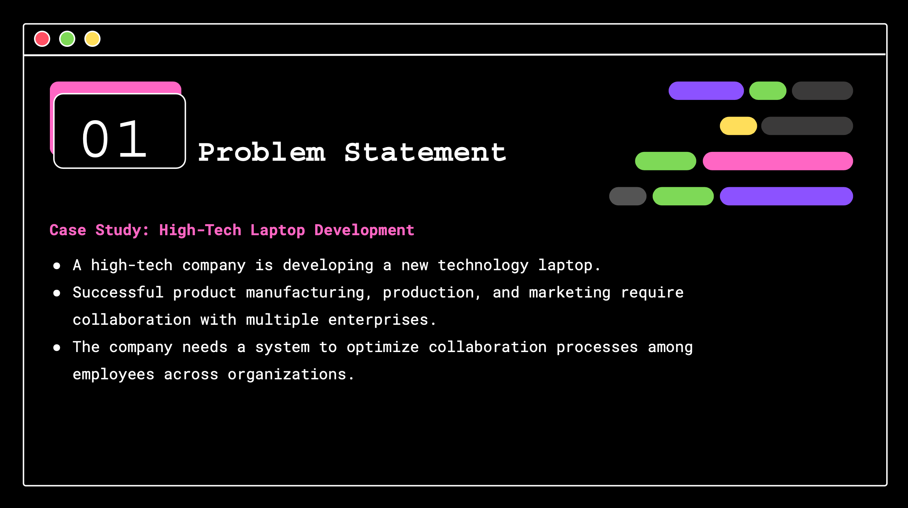
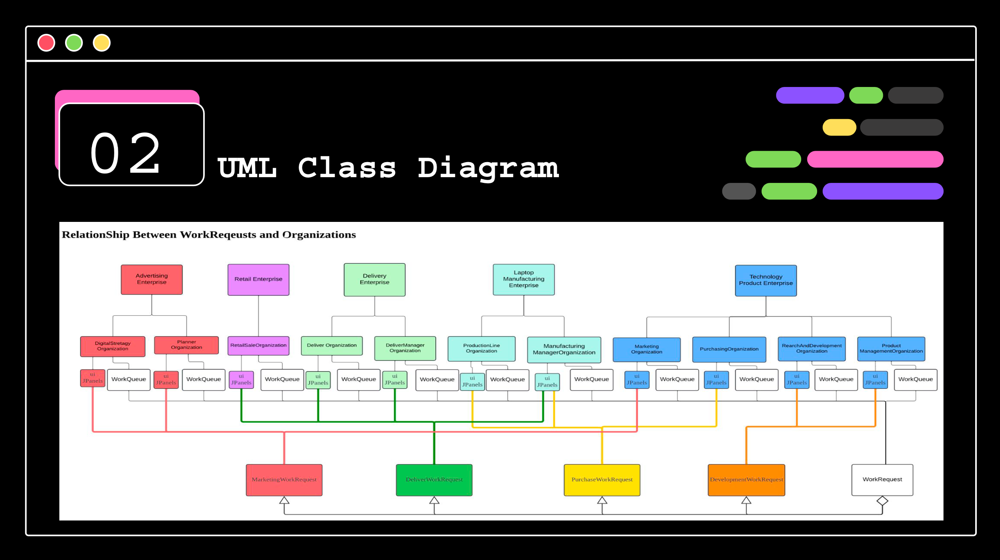
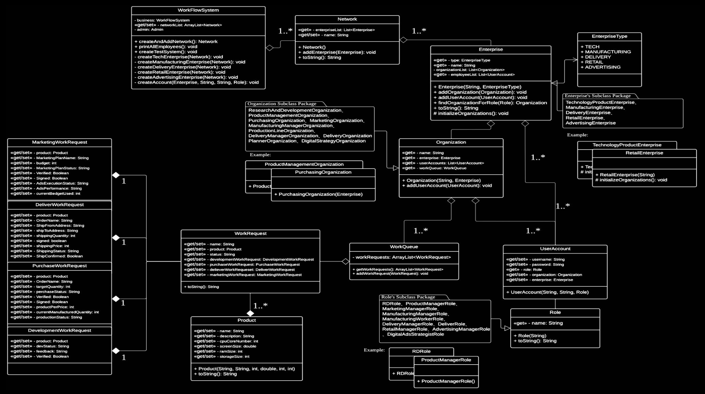
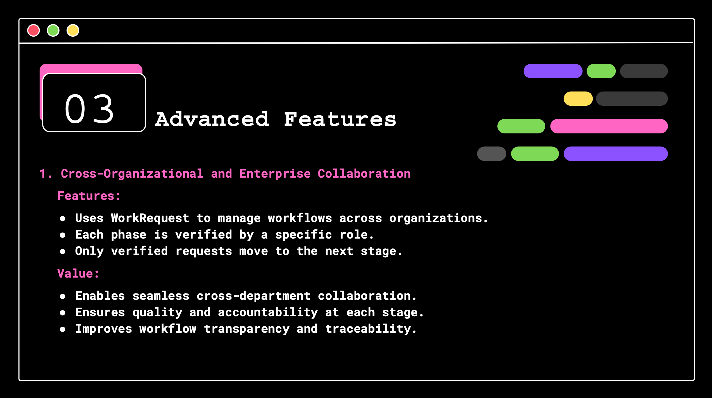
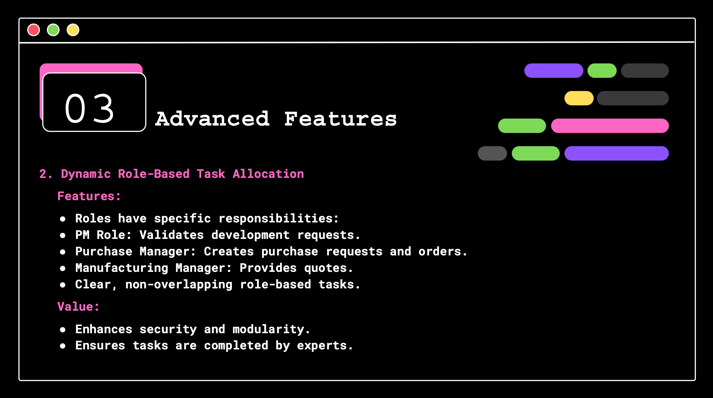
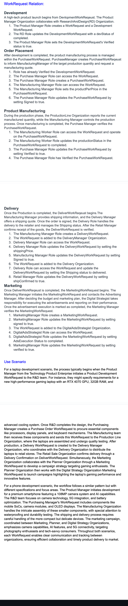

# Labtop Workflow System
Description: A system that helps manage and follow the process of a labtop production ecosystem.

## Download:
1. Click below and download the zip file. 
https://github.com/chs415009/Labtop-Workflow-System.git  

2. Run the Java swing project on Netbeans! 

## Introduction:

 

### Design Logic:

 

### UI Examples:
